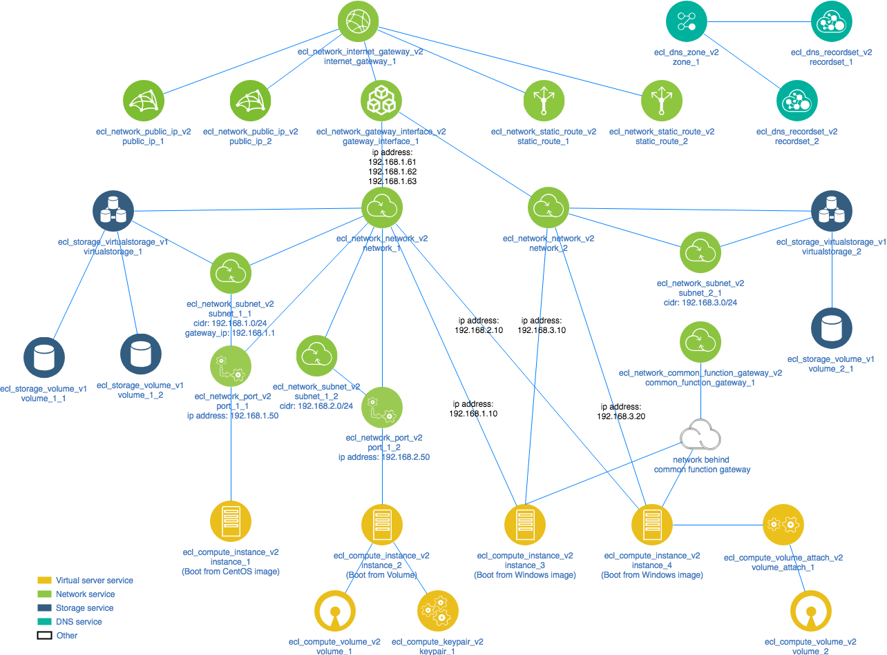

# Basic architecture with networking and storages

This provides a template for running a simple architecture on an Enterprise Cloud 2.0.

First set the required environment variables for the Enterprise Cloud 2.0 provider by

```
source openrc
```
There is a sample of openrc as openrc.sample, so copy, rename it, and fill blank parameters afterward.

Secondary run with a command like this:

```
terraform apply
```

Entire structure of resources created by this command is show below.

